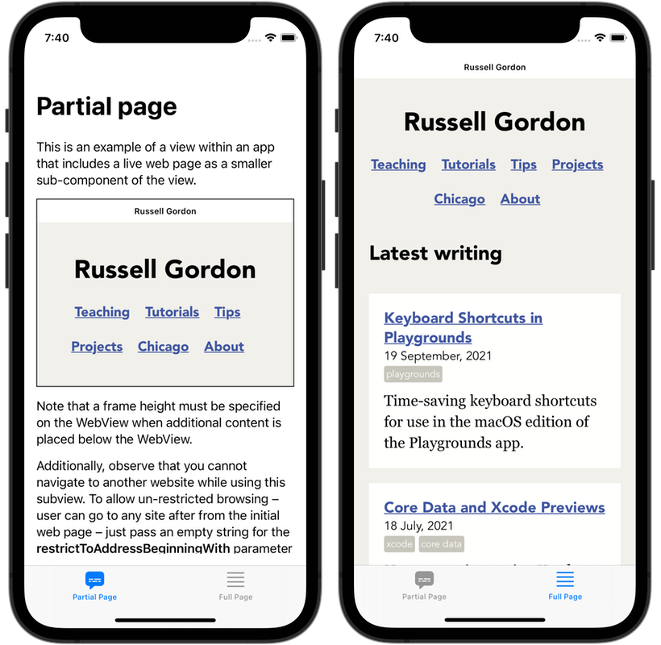
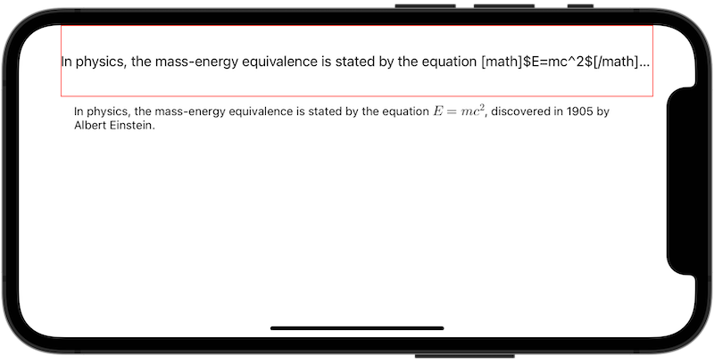

# Culminating Task Code Snippets

This is a workspace to share small code examples, or *snippets*, that various students need to complete their culminating task.

These code snippets represent either:

* a technique that goes beyond reasonable expectations for a student in a Grade 11 course
* a simpler technique that while useful, was not previously shared this year

## Web View

Several students have made plans to show live web pages within their app. This, as opposed to simply using the [`Link` structure in SwiftUI](https://developer.apple.com/documentation/swiftui/link), which simply bumps the user over to the mobile Safari app to view the website.

See:

* [`PartialPageExampleView`](x-source-tag://wv_partial_page)
    * ... for an example of how to load a web view as just a smaller part an existing view
* [`FullPageExampleView`](x-source-tag://wv_full_page)
    * ... for an example of how to load a web view so that it takes up the entire screen
    
To use this within your own app, copy the contents of these groups into your own Xcode project:

* `Model`
    * `WebViewModel.swift`
* `Views`
    * `Helpers`
        * `WebViewContainer.swift`
        * `WebView.swift`

It is recommended that if these groups do not currently exist within your project, that you create them before copying these files over to your project.

## Symbolic Math 

SwiftUI by default does not support the rendering of symbolic math.

However, for certain types of apps, rendering symbolic math is crucial.

The [`RichTextView` third party framework](https://richtextview.com/docs/overview) makes it possible to render symbolic math easily in a SwiftUI project.

Unfortunately, installing and configuring that framework for use within a project is non-trivial.

Mr. Gordon has therefore created an Xcode workspace with `RichTextView` already configured and ready to use.

However, `RichTextView` requires the use of an Xcode workspace – so it is not possible to embed within this project directly (since it is already it's own Xcode workspace).

Therefore, the best way to make use of symbolic math in your app is simply to [fork and clone](https://www.russellgordon.ca/cs/source-control/how-to-fork-and-clone-a-repository/) the [`LatexMathExample` repository](https://github.com/lcs-rgordon/LatexMathExample).

Then, use the code within the `LatexMathExample` workspace as the starting point for your own project.  

Finally, you may be wondering – what the heck is *LaTeX* (pronounced *lay*-teck) – and what does it have to do with symbolic math?

The answer is that LaTeX is a well-established "document preparation system for high-quality typesetting".

If you someday write an academic paper of any kind related to science, technology, engineering, or medicine – it is highly likely you will be using LaTeX to typeset your symbolic math.

So, if you want to show equations within your app, you need to learn LaTeX – fortunately, [there are examples available](https://support.apple.com/en-us/HT202501#sample) and it is not too hard to learn the basics. For what it's worth, Apple's office productivity apps – [Pages](https://apps.apple.com/us/app/pages/id409201541?mt=12) (word processor), [Numbers](https://apps.apple.com/ca/app/numbers/id409203825?mt=12) (spreadsheets), and [Keynote](https://apps.apple.com/us/app/keynote/id409183694?mt=12) (presentations) – which are likely pre-installed on your Mac, [also allow you to write equations using LaTeX](https://support.apple.com/en-us/HT202501).
